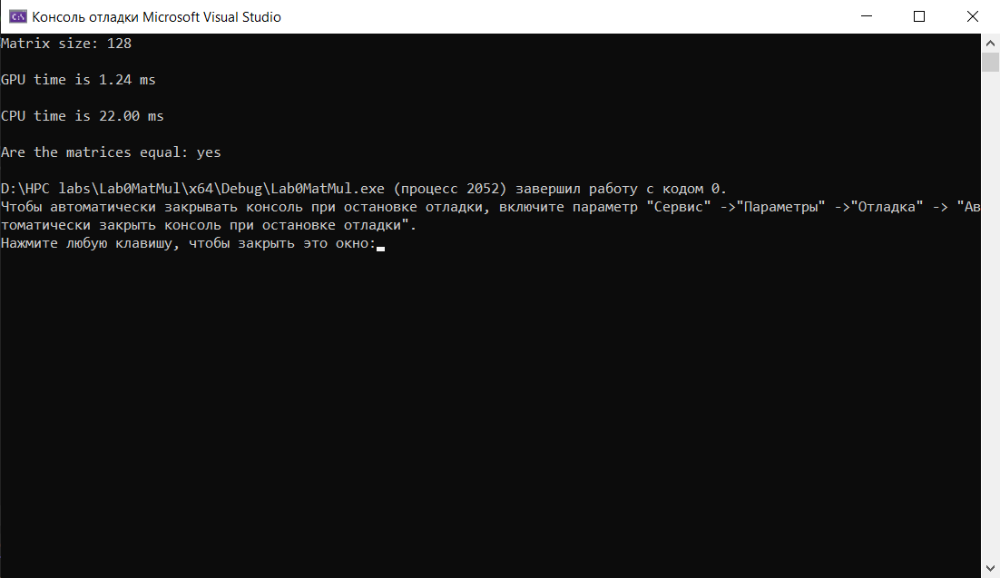
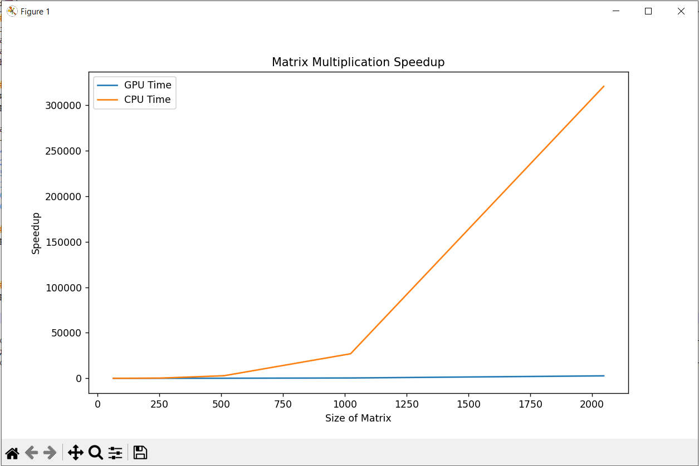
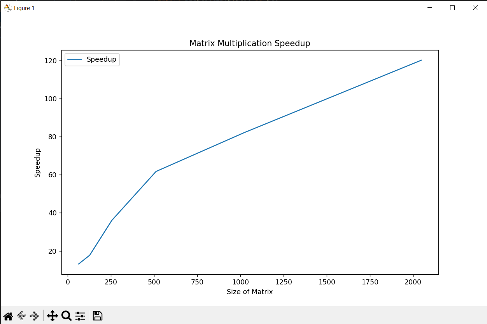

# Лабораторная работа №1 
### Задача
Реализовать алгоритм перемножения матриц.  
Задача: реализовать алгоритм перемножения матриц  
Язык: C++ или Python.  
Входные данные: 2 матрицы размером от 100х100 до 2000х2000 каждая.
Выходные данные: проверка корректности перемножения + время вычисления.  

Реализация должна содержать 2 функции перемножения матриц: на CPU и на GPU с применением CUDA.  

#### Описание работы программы
В программе происходит перемножение двух квадратных матриц размерности sizeMatrix×sizeMatrix, которые заполнены данными, сгенерироваными случайным образом.
Перемножение происходит на CPU и на GPU. После отображения времени перемножения матриц на экране появляется результат проверки равенства полученных матриц.
Пример работы программы представлен ниже:

#### Функции:
FillingMatrices - заполняет обе исходные матрицы firstMatrix и secondMatrix случайными числами при помощи системного времени.
MatMultGPU - функция ядра для перемножения матриц на девайсе(GPU).
MatMulCPU - перемножает матрицы на хосте(CPU).
CheckEquality - возвращает результат проверки сравнения двух результирующих матриц, вычисленных на CPU и GPU.
 
### Результаты
Ниже приведена таблица времени работы параллельной и последовательной функций для различных размерностей матрицы. 
Время указано в миллисекундах и получено как среднее значение по 10 запускам.

Размерность матриц, sizeMatrix | Время работы на GPU, мс | Время работы на CPU, мс | Ускорение
:----:|:-------:|:-----------:|------:
64  | 0,64 | 8,4 | 13,13
128 | 1,17 | 20,8 | 17,73
256 | 6,47| 232,9 | 36,02
512 | 45,34 | 2797,9 | 61,7
1024 | 327,73 | 26924,6 | 82,15
2048 | 2669,94 | 320674,6 | 120,11

### Графическое представление таблицы.
График затраченного времени на рассчёт произведения матриц представлен ниже:

##### График ускорения
График ускорения представлен ниже:

Можно сделать вывод, что время работы функции, которая выполняется на GPU, растёт гораздо более медленно при увеличении размерности матрицы.
Однако время работы функции, которая выполняется на CPU, возрастает заметно быстрее. 
По графику ускорения видно, что программа, написанная на CUDA, дает выигрыш во времени при решении задачи нахождения произведения квадратных матриц. 
