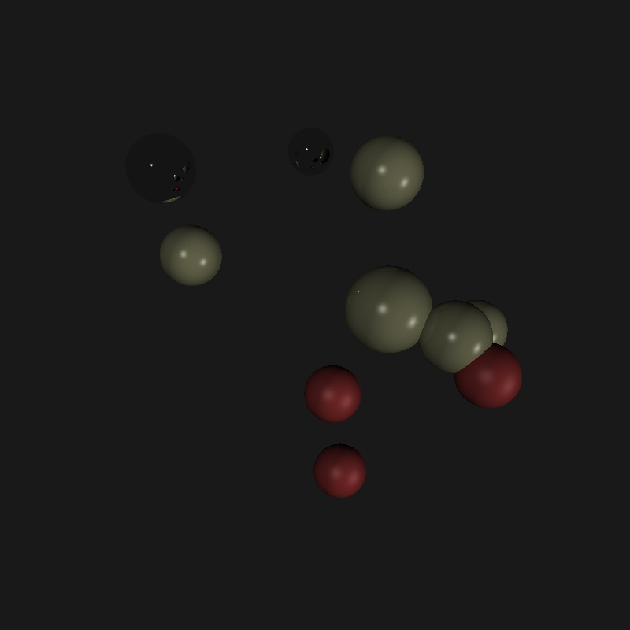

# Лабораторная работа №3 
### Task definition
Implement a simple ray tracing algorithm without refraction rays using GPU. The generated scene should consist
of 5–10 spheres of different colors and 1 or 2 point-like light sources. Maximum depth of recursion is 5. All
objects in the scene are not transparent.
Input data
• The number of spheres (5–10);
• The number of light sources (1–2);
• The resulting image dimensions (800×600–1920×1080);
• The output image filename.
Output data
• The time of scene processing using GPU;
• The resulting image in BMP format.
The program is required to work on Linux machine. The use of CURAND library for generating random 3D scene
parameters is mandatory.
 
#### Описание программы
Функция RayTracing отвечает за трассировку лучей на GPU. 
Функция GenerateSpheres отвечает за генерацию параметров сфер на GPU, используя CURAND.
Функция GenerateLights отвечает за генерацию параметров источников света на GPU, используя CURAND.
Функция CastRay возвращает итоговый цвет пикселя.
Функция SceneIntersect возвращает было ли сделано пересечение сцены лучом.
Функция Reflect возвращает отраженный луч.

В функции RayTracing x и y - это нити, которые отвечают за индекс пикселя. 
После того как итоговый цвет пикселя найден, он записывается в unsigned char массив, который потом будет преобразован в картинку формата bmp.

### Результаты
В консоль выводятся данные о сферах и источниках света.
После этого выводится время выполнения программы.
И наконец появляется окно с картинкой, которая перед этим была сохранена в ту же директорию, где и находится файл .cu.

### Визуализация сцены.
##### Сцена представлена ниже:

Вывод: Знакомство с разработкой приложений на CUDA и библиотекой CURAND прошло успешно.
