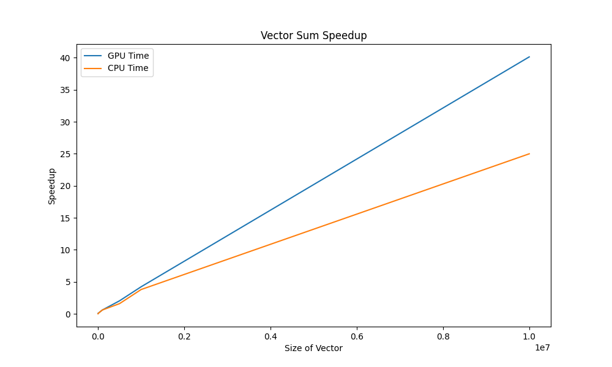
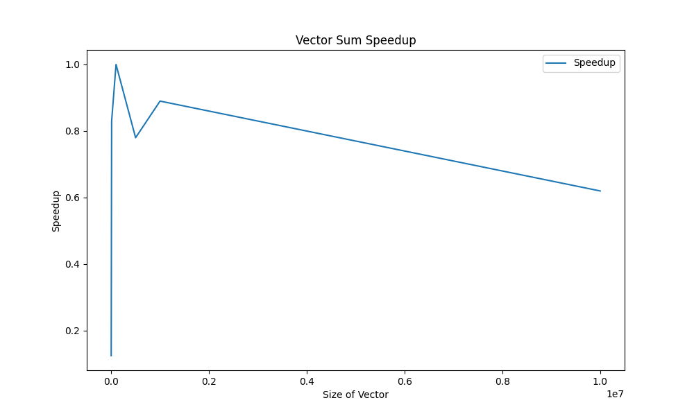

# Лабораторная работа №2 
### Задание
Задача: реализовать алгоритм сложения элементов вектора
Язык: C++ или Python
Входные данные: Вектор размером 1 000..1 000 000 значений.
Выходные данные: сумма элементов вектора + время вычисления
Реализация должна содержать 2 функции сложения элементов вектора: на CPU и на
GPU с применением CUDA.
 
#### Описание программы
Функция SumOnGPU отвечает за вычисление суммы элементов вектора на GPU. 
Для сохранения промежуточных результатов создан массив с разделяемой памятью shArray[]. 
Затем идет вычисление номера нити и получение частичной суммы путем сложения элементов с индексом, равным индексу нити, а затем добавление размерности блока. Это позволяет использовать только один блок для вычислений и избежать ошибок доступа к данным. После этого происходит синхронизация нитей, чтобы избежать ошибок с доступом к данным.
Далее, используя принцип редукции, происходит сложение полученных промежуточных сумм. Сначала складываются каждые две последовательно идущие ячейки, затем происходит синхронизация, и в следующей итерации складываются результаты предыдущей итерации и так далее. Итоговый результат остается в ячейке shArray[0], и значение этой ячейки выводится нулевой нитью.

Функция SumOnCPU выполняет последовательное сложение элементов вектора.

### Результаты
Ниже приведена таблица времени работы параллельной и последовательной функций для различных размерностей векторов. Время указано в миллисекундах и получено как среднее по 10 запускам.

Размерность , N | Время работы на GPU, мс | Время работы на CPU, мс | Ускорение
:----:|:-------:|:-----------:|------:
1000 | 0,08 | 0,01 | 0,125
10000 | 0,12  | 0,1 | 0,83
100000 | 0,6 | 0,6 | 1
500000 | 2,04 | 1,6 | 0,78
1000000 | 4,23 | 3,8 | 0,89
10000000 | 40,14 | 25,0 | 0,62

### Визуализация таблицы.
##### График затраченного времени на рассчёт суммы элементов вектора представлен ниже:

##### График ускорения представлен ниже:

Исходя из полученных результатов можно сделать вывод, что использовние GPU становится выгодным только при довольно больших размерностях входного массива, так как иначе время затрачиваемое на подготовку к параллельным вычислениям невелирует преимущество этих вычислений. На моем компьютере ускорение меньше единицы практически везде, что показывает, что данная задача не самая подходящая для распараллеливания.
